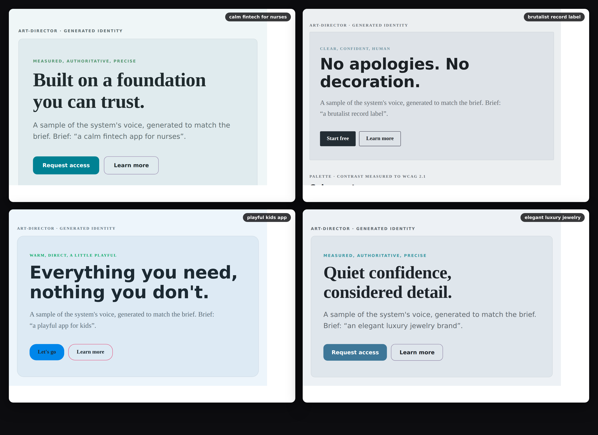
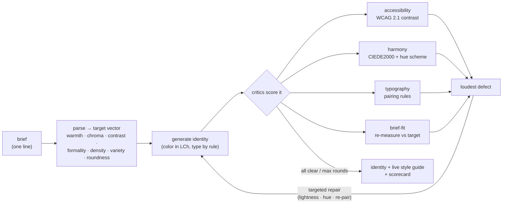
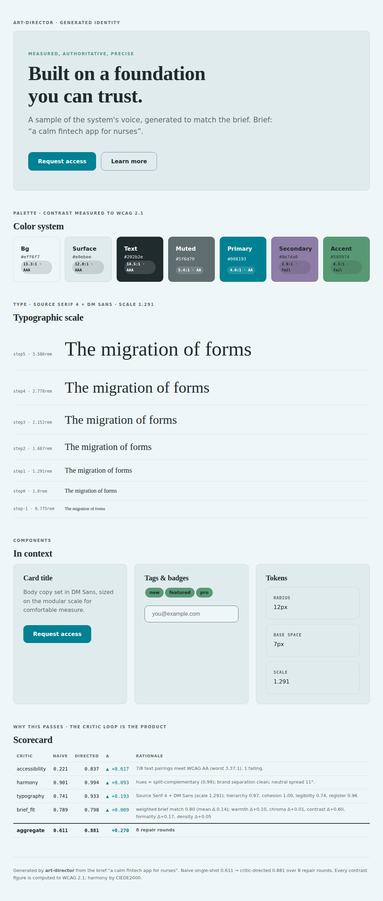
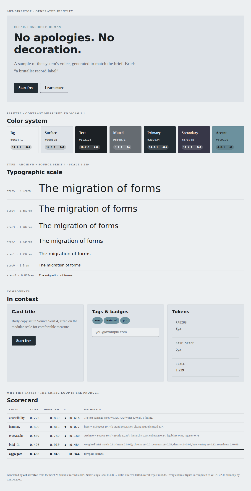
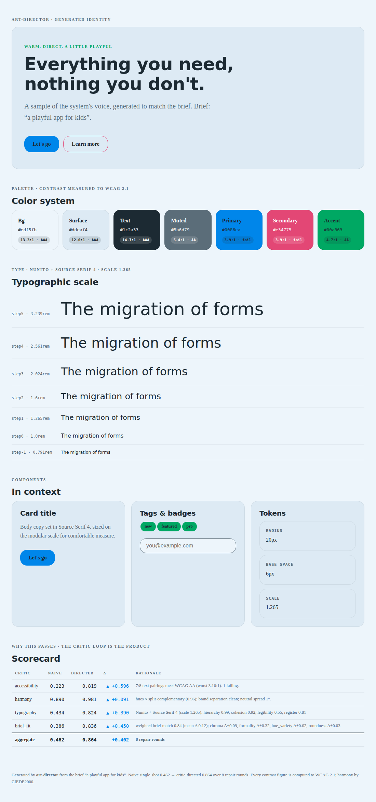
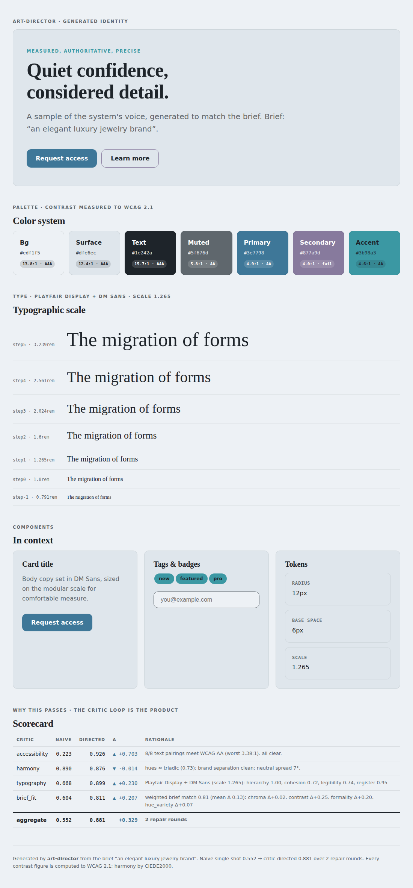

# art-director

**Taste, made computable.** Give it a one-line brief — *"a calm fintech app for nurses"*, *"a brutalist record label"* — and it returns a complete, coherent **visual identity**: a roled color palette, a typeface pairing, a spacing scale, a corner radius, and a voice. Then it does the thing a one-shot generator never does — it **critiques its own output against measurable rubrics and repairs what fails**, and renders the result as a live, art-directed style guide.



The point this repo makes, and measures: **most of "good design" that people call subjective is actually checkable.** Contrast is a number (WCAG 2.1). Color harmony is geometry plus a perceptual distance metric (CIEDE2000). A type pairing is a small set of rules about hierarchy and register. Brief-fit is the distance between what you asked for and what the artifact actually measures. The engine generates by taste, then a panel of **critics** holds that taste to account — and the eval reports the lift, honestly.

> The headline result: across 12 briefs, ungoverned single-shot generation passes WCAG AA contrast on **12% of text pairings**. The same generator wrapped in the critic loop reaches **92%** — because *you cannot eyeball a 4.5:1 contrast ratio, you have to compute it.*

Everything runs on CPU with **zero dependencies** (pure standard library); the numbers below are produced by `eval/run_eval.py`, not asserted.

---

## Results

12 briefs · seed 7 · scores in [0, 1], higher is better. Each row adds one capability.

| configuration | accessibility | harmony | typography | brief-fit | **aggregate** | **WCAG AA pass** |
|---|---|---|---|---|---|---|
| naive (single-shot) | 0.223 | 0.888 | 0.690 | 0.617 | 0.558 | 0.125 (12/96) |
| + brief-steered generator | 0.834 | 0.909 | 0.904 | 0.827 | 0.862 | 0.875 (84/96) |
| **+ critic loop** | **0.864** | **0.925** | **0.904** | **0.828** | **0.876** | **0.917** (88/96) |

### How to read this

- **Accessibility is where ungoverned generation fails hardest.** A naive single-shot generator samples plausible colors near the brief's hue and calls it done — and lands text-on-background contrast at AA on just **12%** of the pairings a real UI renders. The critic loop measures every pairing and pushes lightness until it clears the threshold: **92%**. This is the critic loop's irreplaceable contribution.
- **The brief-steered generator (middle row) already recovers most of the harmony and brief-fit gap.** Placing color in perceptually-uniform LCh space and selecting type by rule gets you a long way. That's the honest caveat: a careful generator is most of the battle. What it *cannot* do is guarantee a hard accessibility floor — generation-by-taste leaves that open, and only measurement closes it.
- **The aggregate lift is 0.558 → 0.876**, in a mean of ~5 repair rounds. The loop never ships a result worse than where it started (enforced in tests).

Full table, per-critic rationale, and honest notes regenerate into [`eval/results.md`](eval/results.md).

---

## The idea: a critic panel, not a vibe

A single-shot generator answers *"what looks good?"* once and stops. An art **director** asks *"what's wrong with this, specifically, and how do I fix that one thing?"* — repeatedly. That's the loop:



Each critic returns a score, a plain-English rationale, and a list of **concrete defects** (`low_contrast: muted on bg 3.1:1, need 4.5`). The loop selects the loudest defect, applies the repair that targets *that defect kind*, and keeps the change only if the aggregate improves. The repair is explainable, not a re-roll: a contrast failure darkens exactly the offending role until it clears AA; a muddy color pair rotates one hue until the two are perceptually distinct (ΔE ≥ 10).

---

## The critics

| critic | file | what it measures | how |
|---|---|---|---|
| **accessibility** | `critics/accessibility.py` | WCAG 2.1 contrast on every text/bg and white-on-button pairing | relative luminance → contrast ratio; AA thresholds (4.5 normal, 3.0 large) |
| **harmony** | `critics/harmony.py` | palette coherence | brand hues scored against nearest named scheme (analogous/complementary/triadic); brand colors must be perceptually separated (CIEDE2000 ΔE ≥ 10); neutrals must share a temperature |
| **typography** | `critics/typography_critic.py` | pairing quality | encoded rules: hierarchy (category + stroke-contrast difference), cohesion (shared x-height band), body legibility, register fit to the brief |
| **brief-fit** | `critics/brief_fit.py` | does the *finished artifact* match the ask | re-derive the seven design axes from the output (independent of generator inputs) and compare to the brief's weighted target |

The color science (`color.py`) is the bedrock and is validated against published reference data — WCAG black/white = 21:1 exactly, and the full **Sharma, Wu & Dalal (2005) CIEDE2000 test set**, including the hue-discontinuity pairs that break naive implementations (`tests/test_color.py`).

---

## From language to a measurable target

The move that makes the rest computable: a small **design lexicon** (`brief.py`) maps adjectives to target positions on seven axes, weighted by confidence.

```
"a brutalist record label"
  cues: brutalist
  target:  contrast 0.95 ·  chroma 0.15 ·  roundness 0.05 ·  density 0.70 ...
```

*Brutalist* pulls contrast high, chroma and roundness to the floor; *calm* pulls warmth cool and chroma low; *luxury* pulls formality up and hue-variety down. Unknown words are ignored; a brief with no cues yields a neutral target, and the critics then judge only intrinsic quality (you still can't ship failing contrast). The generator reads that target and places color in **LCh** — the space where lightness, chroma, and hue are exactly the axes the brief constrains and the critics measure — so the whole loop stays steerable.

---

## Quickstart

```bash
python -m pip install -e ".[dev]"          # zero runtime deps; dev adds pytest+ruff
python -m art_director "a calm fintech app for nurses"
python -m art_director "a brutalist record label" --html out.html      # live style guide
python -m art_director "a playful kids app" --tokens tokens.json       # portable design tokens

python eval/run_eval.py                     # the ablation table above (~3s, CPU)
python scripts/build_gallery.py             # render all 12 briefs + gallery/index.html
pytest -q                                   # 59 tests incl. the CIEDE2000 reference set
```

CLI output names the lift, the per-critic scores with rationale, the palette, and the chosen type pairing.

---

## The artifact

`--html` renders a **self-contained, art-directed style guide** — the proof of craft, not a JSON dump. Palette with a live WCAG badge on every swatch, the modular type scale in situ in the chosen faces, components (buttons, card, input, tags), a hero in the system's generated voice, and the critic **scorecard** that produced it. One file, no build step, only the two Google Fonts the pairing selected.

| `a calm fintech app for nurses` | `a brutalist record label` |
|---|---|
|  |  |
| **`a playful app for kids`** | **`an elegant luxury jewelry brand`** |
|  |  |

Each is generated from the brief alone — the teal-and-serif calm of the fintech identity, the achromatic ink and tight slabs of the brutalist one, Nunito and saturated color for kids, restrained Playfair for luxury. Same engine, different briefs.

---

## Design tokens out

`--tokens` emits a portable contract you can drop into a real codebase:

```json
{
  "brief": "a calm fintech app for nurses",
  "color": { "bg": "#eff6f7", "text": "#202b2e", "primary": "#008193", "accent": "#589974", ... },
  "type":  { "heading": {"name": "Source Serif 4", "stack": "..."},
             "body": {"name": "DM Sans", "stack": "..."},
             "scaleRatio": 1.292, "googleFontsUrl": "https://fonts.googleapis.com/..." },
  "space": [6, 12, 18, 24, 36, 48, 72], "radius": 12,
  "voice": { "tone": "...", "headline": "...", "cta": "..." }
}
```

---

## Scope and honest notes

- **Rubric scores are a proxy for taste, not taste itself.** They measure conformance to *encoded, inspectable* design rules. That's the deliberate trade: a defensible, auditable approximation you can argue with, rather than an opaque preference. The rules are the contribution; tune them in one place.
- **The naive baseline is not a strawman.** It samples plausible colors near the brief hue exactly as an ungoverned single-shot generator does, with a fixed default type pairing. Its failure mode is the real one: text a touch too light, brand colors that collide, button labels that miss AA.
- **Brief-fit is measured from the rendered artifact** — warmth, chroma, contrast, etc. re-derived from the output, independent of the generator's inputs — so it catches drift between intent and result.
- **An LLM judge is the natural next layer, not the core.** The always-on critics are deterministic and free by design (same reason genealogy-graphrag's eval runs without the cross-encoder). A model-as-judge for semantic brief-fit ("does this *feel* like a hospital?") slots in above this floor; it doesn't replace it.
- **The lexicon and font catalogue are intentionally small** — enough to separate the configurations cleanly and keep the run deterministic and fast. Both are plain data; extending them is the obvious first contribution.

---

## Repository layout

```
art-director/
├── src/art_director/
│   ├── color.py            # WCAG luminance/contrast, CIEDE2000, sRGB↔Lab↔LCh  (validated)
│   ├── brief.py            # design lexicon → measurable 7-axis target
│   ├── typography.py       # font catalogue + encoded pairing rules
│   ├── identity.py         # the Identity; brief-steered + naive generators (LCh)
│   ├── critics/            # accessibility · harmony · typography · brief_fit
│   ├── loop.py             # the self-critique + targeted-repair loop
│   ├── render.py           # Identity → self-contained art-directed HTML
│   └── cli.py              # python -m art_director "<brief>" [--html] [--tokens]
├── eval/                   # briefs.jsonl, run_eval.py, results.md / results.json
├── gallery/                # rendered identities + screenshots + index.html
├── scripts/                # build_gallery.py, shoot_gallery.py
├── tests/                  # 59 tests incl. the Sharma CIEDE2000 reference set
└── .github/workflows/ci.yml
```

MIT-licensed. CI runs lint, the full test suite, and the ablation eval — with a guard asserting the critic loop holds ≥85% AA pass-rate and beats the naive baseline by ≥0.2 aggregate, so a regression in the loop fails the build.

---

## Context

Part of [**axiom-orion**](https://github.com/axiom-orion) — small, eval-driven engineering pieces that each turn one hand-waved claim into a reproducible number. The generate-then-critique loop and measurable rubrics shown here are the same principle the [**Vorion**](https://github.com/vorionsys) governed-AI platform (`@vorionsys/*`) applies to autonomous agents: don't trust a single shot — hold the output to account and repair what fails. Built by [Ryan Cason](https://github.com/vorionsys).
